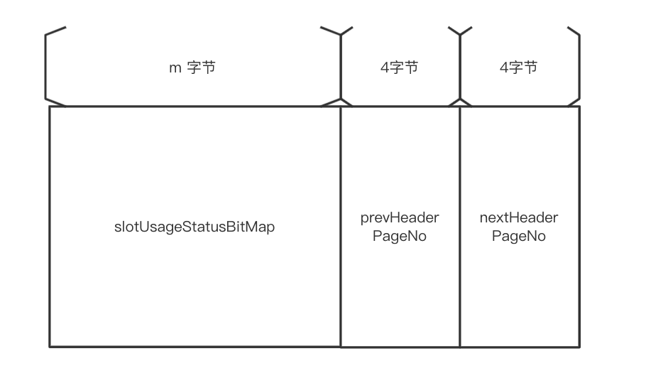
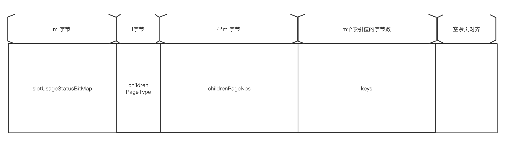
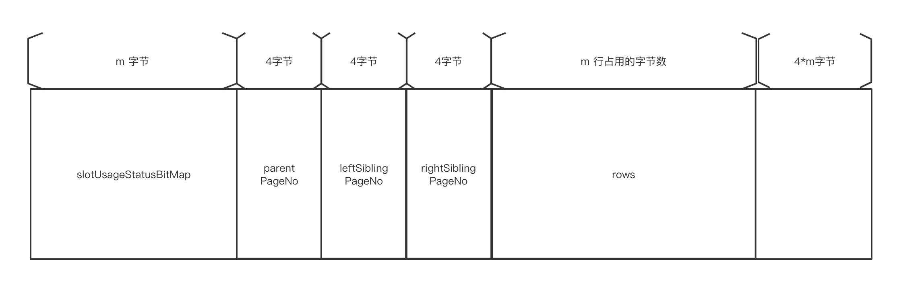
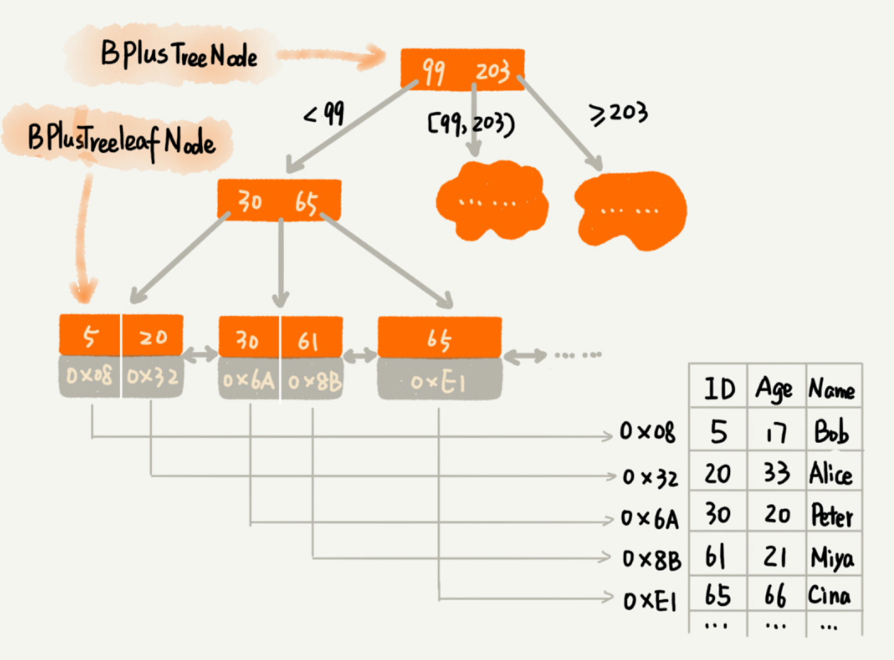
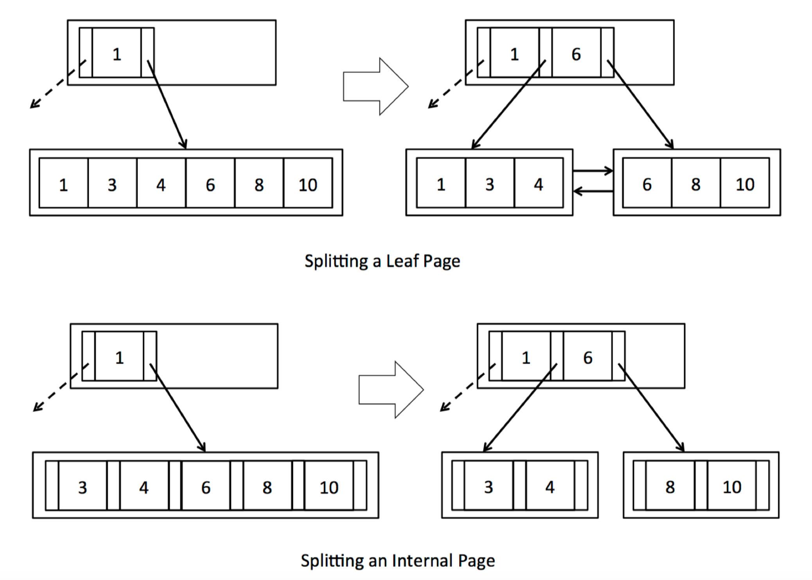
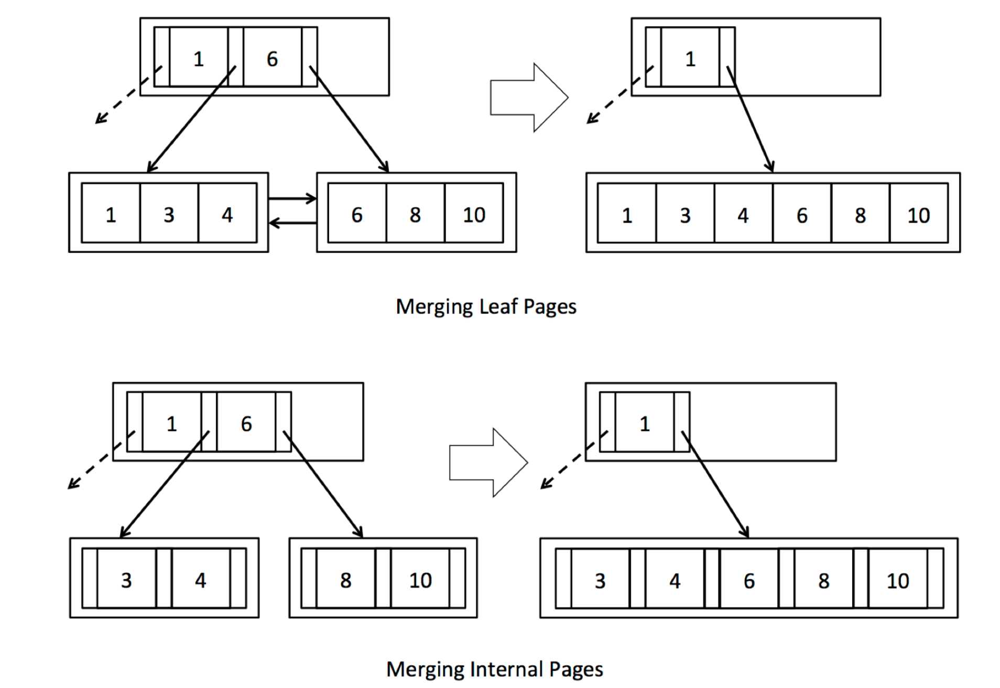
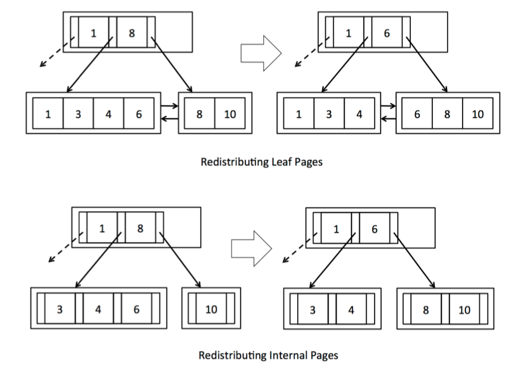

## 关系型DB从0到1——基于Java语言的简易数据库

本项目旨在练习实现一个基于Java语言的简易关系型数据库，用来学习关系型数据库(如Mysql)的设计理念、核心骨架、基本算法。

涉及缓存、数据底层存储结构(B+树)、锁、事务、优化器、redo/undo log等核心原理。

### 1.关系数据结构基本定义

添加数据库、表、行、字段等基础定义

### 2.数据持久化

每一个表存储成为一个物理磁盘文件，随着表数据变多，一个表对应的物理磁盘文件可以无限变大，全部读取到内存中肯定是不可取的，编写程序时应每次磁盘IO读取一个数据块，操作系统与磁盘一般是以4k为以页的单位来交互的，因此我们读写数据也以4KB page为基本单位。

添加文件、页、表结构描述等定义
添加表文件（DbFile）的方法: writePageToDisk、readPageFromDisk，实现从表的磁盘文件中写入一页数据、读取一页数据

完成 单例dataBase对象
完成 page中需要依赖table相关的属性，新增pageID类，以便于在page中引用table
完成 heapPage 序列化、反序列化及page落盘持久化

**小结:实现了以下功能**

1. 创建数据库实例,单例的DataBase对象
2. 新增表,目前字段类型仅支持int类型
3. 插入行数据，仅内核实现，不支持sql解析
4. 数据的落盘持久化
   - 数据目录组织：存取均以page单位
   - 底层存储结构：page中数据的基本存储格式为插槽(slot)状态位+行数据+末尾填充字节

### 3.操作符(operator)

操作符是对表中数据的最底层操作，通常有以下几种：

- 全表扫描：不带where条件的select * 获取表中所有数据

- 条件过滤：条件有>、<、=、<=、>= 、!=、like等等
  
   - 表的连接：多个表的join
   
- 聚合: sum、average等
   - 等等
   
     

   上层将底层的多个操作符进行组合，以实现特定的操作。比如：select * from table_a where id>100; 组合了全表扫描+条件过滤2个操作符。

   
   
   **小结:操作符部分实现了以下功能**
   
   1. 最基本操作符，表中数据顺序扫描 Seq
   2. Filter条件过滤
   3. OrderBy排序
   4. Aggregate聚合，目前只支持int字段，后续实现其他类型
   5. Join 连接
   6. Delete 删除
   
### 4.基于B+Tree的的文件组织与索引

   聚簇索引的定义：如果数据记录(即行记录)的顺序与某个索引的key顺序相同，那么就称这一索引为聚簇索引。

   在用B+Tree组织数据时，聚簇索引树的叶子节点存储的都是行记录，即整张表数据，访问时从树的根节点一级一级向下找，直至找到叶子节点，读取行数据。

   

   #### B+Tree  文件布局

页类型区分为四种：RootPTRPage、HeaderPage、InternalPage、LeafPage

RootPTRPage格式如下，记录树的根节点所在的pageNo、根节点所在Page的类型（internal 或leaf）、第一个HeaderPage

HeaderPage格式如下，作用是跟踪整个文件中使用的页，记录的使用状态，用于回收和重用，所有的header page 以双向链表连接

InternalPage 格式如下，用于存储索引值

TODO 已经重构，图片待更新

LeafPage格式如下，聚簇索引中存储整行数据，普通索引中存放索引value本身

#### B+树 表的存储

以下存储一个表的示例，图中的Node对应上面的一个page（如图中的[99,203]标示的是一页中存储两个元素），在micro-DB B+树实现中，每次存储或读取都是以页为单位。

#### 基于B+树的表文件存储基本操作

##### 页分裂

Leaf page 分裂：页分裂发生在插入数据时，当向一个叶子页中插入数据时，当该叶子页存满，会触发页分裂：创建一个新页并把原页中的元素按顺序分布到两个页面中，然后将中间位置的索引值提取到树的上一层，如果该上一层也满，则递归触发页分裂。

internal page 分裂：与leaf page类似，但存在一点区别，如图所示，leaf page提取索引到上层，是"复制"操作，internal page 提取索引到上层，是”移动“操作。

##### 页合并

页合并发生在删除数据时，随着页内元素的删除，会出现许多空洞，页合并的目的是为了保证空间利用率。

当某个页面在删除元素后，元素数量不足页半满，如果它的兄弟页也不足半满，则将两个页合并，释放空间。

如图所示，当合并后，合并页在上层的索引需要删除

##### 页重分布

重分布发生在删除数据时，与页合并的目的相同，一方面提升空间利用率，一方面为了维持树的平衡。

当某个页面在删除元素后，元素数量不足页半满，但兄弟页有足够的元素（超过半满），则从兄弟页中挪用元素补充，补充后，两页数量均等。

### 5. Buffer Pool 缓冲池

未使用缓冲池的实现中，当对页做了修改时立即刷盘、每次读取页时需要从磁盘读入，磁盘IO非常多，是一个性能瓶颈

通过缓冲池来解决这个问题，保持常用的页面常驻内存、脏页(修改过的页)不必立即刷新，通过一定的驱逐策略，待缓冲池满时，将使用频率低的页面从缓冲池中删除。

缓冲池开发较简单，目前实现

#### 缓冲池

以页为单位做缓存，预留参数，可配置缓冲区可容纳的最大页数。如果缓冲区满，则驱逐不常用页。**目前尚未实现任何缓存失效算法：缓冲区满时直接暴力清除所有页。**

#### 脏页跟踪

使用ThreadLocal实现：在数据操作过程中，将修改过的页放入ThreadLocal。操作执行完毕后转移至缓冲池。

#### 缓存失效算法

为了高效利用缓冲区，需要应用一种缓存缓存失效算法，在驱逐不常用页时使用：**后面有时间会实现LFU算法**

### 6.事务、并发控制

#### 事务

事务是关系型DB中不可缺少的特性。事务有ACID四大特性：原子性、一致性、隔离性、持久性。后面的基于锁的并发控制、刷盘策略都与事务有密切的关系。

通俗的解释：事务划定了一个起始与结束的边界。

原子性：整个事务范围内的所有操作满足原子性，整个事务中的数据更新操作，要么全部成功，要么全部撤销。

隔离性：多个并发的事务之更新的数据不会互相影响。

持久性：事务提交后，数据会持久化。

一致性：一致性是最终的目的，AID保证C。

##### 事务实现

Transaction：定义事务，有一个ID属性，构造事务时，生成自增的事务ID

Transaction 中提供提交、回滚方法

####  基于锁的并发控制（2PL协议）

最简单实现事务ACID特性的方法是串行化，即保证任意时刻最多只有一个事务在运行。但这样并发度太低了，性能很差。

为此我们引入了锁，锁是多个线程访问同一资源的机制。在这里，线程是事务，资源是数据页。

##### 锁的粒度

页级锁，实现行级锁较复杂，在这里实现以页为单位的锁，前面功能的实现，对数据的存、取、缓冲池都是以页为单位，在此基础上实现页锁会比较容易。

##### 锁的类型

实现独占锁（X锁）和共享锁（S锁），进一步提升并发性。

当一个事务要对数据更新时，需使用X锁；对数据仅读取时，需使用S锁。

##### 加锁与解锁

采用典型的两阶段锁（2 phase lock），锁的生命周期：事务开启后，执行第一条语句开始加锁，事务提交/终止时解锁。

由于所有的数据操作都会从BufferPool.getPage()读取页数据开始，因此在该方法里加锁

在transaction.commit/abort 方法里解锁

##### 死锁和死锁检测

在使用了锁后，发生死锁、某个线程长时间占有锁阻塞其他线程进入等情况是极有可能发生的

死锁检测与释放的实现：通过检测锁的持有时间、超时自动释放锁

##### 锁的实现

实现一个锁管理器，维护事务与事务访问的页的关系，记录事务持有哪些页、页被哪些事务持有

事务访问一个页中，先检查事务管理器中维护的锁类型及相关的记录，授予锁或阻塞等待。

#### 缓存刷盘策略

##### No-steal/Force

在该策略下，**缓冲池中未提交事务的数据不能刷盘、提交的数据必须刷盘，这是目前采用的策略。**

实现：页中添加了一个状态标识是否为脏页。在缓存驱逐时，由于考虑到不能将脏页刷盘，因此需要保留在脏页在内存里，只能驱逐干净页。事务提交时，将脏页刷盘，并更新缓存中页的状态为为非脏页。

#####  Steal/No-force

在该策略下，**缓冲池中未提交事务的数据可以写入磁盘，已提交事务的数据可以暂不写入磁盘**。该策略的目的是提升缓存管理的性能，但会带来新的问题……

### 7.undo log

#### 为什么需要undo log 

为了提升缓存管理的性能，我们将使用Steal/No-force策略取代No-steal/Force策略，该策略下，**缓冲池中未提交事务的数据可以写入磁盘，已提交事务的数据可以暂不写入磁盘**。我们无需在每次提交事务时写盘了，仅在缓存驱逐刷盘即可，而且未提交的事务数据页可以写刷盘。减少刷盘了的时机，缓存的使用效率页变的更高。

由此产生了一个新的问题：如果一个事务最终回滚了，但脏页在回滚之前被刷盘了，为了一致性，我们需要将磁盘中的数据回滚到原始状态。

如何解决这个问题，我们需要借助日志，在每个页刷盘之前，将事务ID、原始状态的页一起写入日志文件（undo log）中，日志写入成功再刷盘。这样如果事务回滚了，我们可以根据事务ID从undo log中取出原始状态的页，将数据文件中和缓存中对应的页恢复至修改前状态。

#### undo log 数据读写粒度

这里实现的是页级别的undo，写入日志和回滚数据都是以页为单位。

#### undo log 实现

DataBase实例中添加一个undo log对象，维护一个文件。

当一个页从磁盘读入内存时，页是最原始状态，此刻生成页的一个快照。

当页被刷盘之前，将修改页的事务ID+原始数据快照写入undo log中，undo log写入成功才刷盘。

当一个页在事务提交成功时，重新生成快照，事务提交后的页等同于原始状态页。虽然这时页还没有持久化。（提交后但未刷盘的页将由redo log 保证持久性）

当事务回滚，根据事务ID从undo log中查找出该事务关联的所有原始页，恢复至修改前状态，并同步恢复缓冲池。

### 8.redo log

#### 为什么需要redo log 

前面提到，为了提升缓存管理的性能，我们将使用Steal/No-force策略取代No-steal/Force策略，该策略下，**缓冲池中未提交事务的数据可以写入磁盘，已提交事务的数据可以暂不写入磁盘**。事务提交时可以暂不将数据写入磁盘。

带来的新问题：已提交事务的数据未写入磁盘，服务器宕机，这一部分数据就完全丢失了。这违背了事务的持久性。

解决这个问题，在事务提交时，将事务中修改过的页写入日志（redo log），日志写入成功再释放锁。有了日志后，即使服务器再发生崩溃，也可以保证数据不丢失，重启后从日志中取出这部分记录，重新做一遍刷盘，便可将数据恢复。

可能有人会疑问写页数据要写入磁盘，写日志文件同样要写入磁盘，何必多此一举呢？

这是因为写日志是顺序写，而写数据本身是随机写。顺序写效率会更高，由于目前实现的是页粒度的读写，随机写只发生在页之间，效率相差不太明显，在引入行粒度的读写机制后，顺序写的优势就更明显了。这就是 **WAL** 技术(**Write-Ahead Logging**)，数据库的设计中很普遍。

#### Redo log 数据读写粒度

页级别

#### redo log 实现

DataBase实例中添加一个redo log对象，维护一个文件。

事务提交时将，com.microdb.transaction.Transaction#commit中将事务ID和修改的数据写入日志。

当数据库崩溃后恢复，com.microdb.logging.RedoLogFile#recover从日志中找出所有提交的日志，将其数据恢复至磁盘。

  

