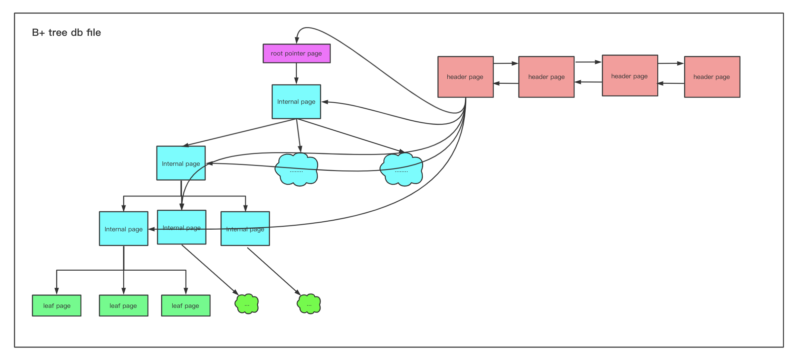

## 关系型DB从0到1——基于Java语言的简易数据库

本项目旨在练习实现一个基于Java语言的简易关系型数据库，用来学习关系型数据库(如Mysql)的设计理念、核心骨架、基本算法。

涉及缓存、数据底层存储结构(B+树)、锁、事务、优化器、redo/undo log等核心原理。

### 1.关系数据结构基本定义

添加数据库、表、行、字段等基础定义

### 2.数据持久化

每一个表存储成为一个物理磁盘文件，随着表数据变多，一个表对应的物理磁盘文件可以无限变大，全部读取到内存中肯定是不可取的，编写程序时应每次磁盘IO读取一个数据块，操作系统与磁盘一般是以4k为以页的单位来交互的，因此我们读写数据也以4KB page为基本单位。

添加文件、页、表结构描述等定义
添加表文件（DbFile）的方法: writePageToDisk、readPageFromDisk，实现从表的磁盘文件中写入一页数据、读取一页数据

完成 单例dataBase对象
完成 page中需要依赖table相关的属性，新增pageID类，以便于在page中引用table
完成 heapPage 序列化、反序列化及page落盘持久化

**小结:实现了以下功能**

1. 创建数据库实例,单例的DataBase对象
2. 新增表,目前字段类型仅支持int类型
3. 插入行数据，仅内核实现，不支持sql解析
4. 数据的落盘持久化
   - 数据目录组织：存取均以page单位
   - 底层存储结构：page中数据的基本存储格式为插槽(slot)状态位+行数据+末尾填充字节

### 3.操作符(operator)

操作符是对表中数据的最底层操作，通常有以下几种：

- 全表扫描：不带where条件的select * 获取表中所有数据

- 条件过滤：条件有>、<、=、<=、>= 、!=、like等等
  
   - 表的连接：多个表的join
   
- 聚合: sum、average等
   - 等等
   
     

   上层将底层的多个操作符进行组合，以实现特定的操作。比如：select * from table_a where id>100; 组合了全表扫描+条件过滤2个操作符。

   
   
   **小结:操作符部分实现了以下功能**
   
   1. 最基本操作符，表中数据顺序扫描 Seq
   2. Filter条件过滤操作符
   3. OrderBy排序操作符
   4. Aggregate聚合操作符，目前只支持int字段，后续实现其他类型
   5. Join连接操作符
   
   
   
   ### 4.基于B+Tree的的文件组织与索引
   
   聚簇索引的定义：如果数据记录(即行记录)的顺序与某个索引的key顺序相同，那么就称这一索引为聚簇索引。
   
   在用B+Tree组织数据时，聚簇索引树的叶子节点存储的都是行记录，即整张表数据，访问时从树的根节点一级一级向下找，直至找到叶子节点，读取行数据。
   
   
   
   实现此方案基本的类如下：
   
   BTreeFile:数据存储的文件
   
   RootPage：树的根节点所在的pageNo、根节点所在Page的类型（internal 或leaf）、第一个HeaderPage
   
   HeaderPage:以链表形式存储internalPage 和 leafPage 的目录、页空满状态
   
   InternalPage：存储key值
   
   LeafPage：存储整行数据

1、B+tree 页的结构图

header page：记录每一个页的使用状态

2、microDB中-底层的存储结构：page中数据的存储格式
每种page的存储格式描述、图

3、新增行：页分裂、递归分裂、更新各级节点

代码骨架

TODO :用线程本地变量实现脏页管理